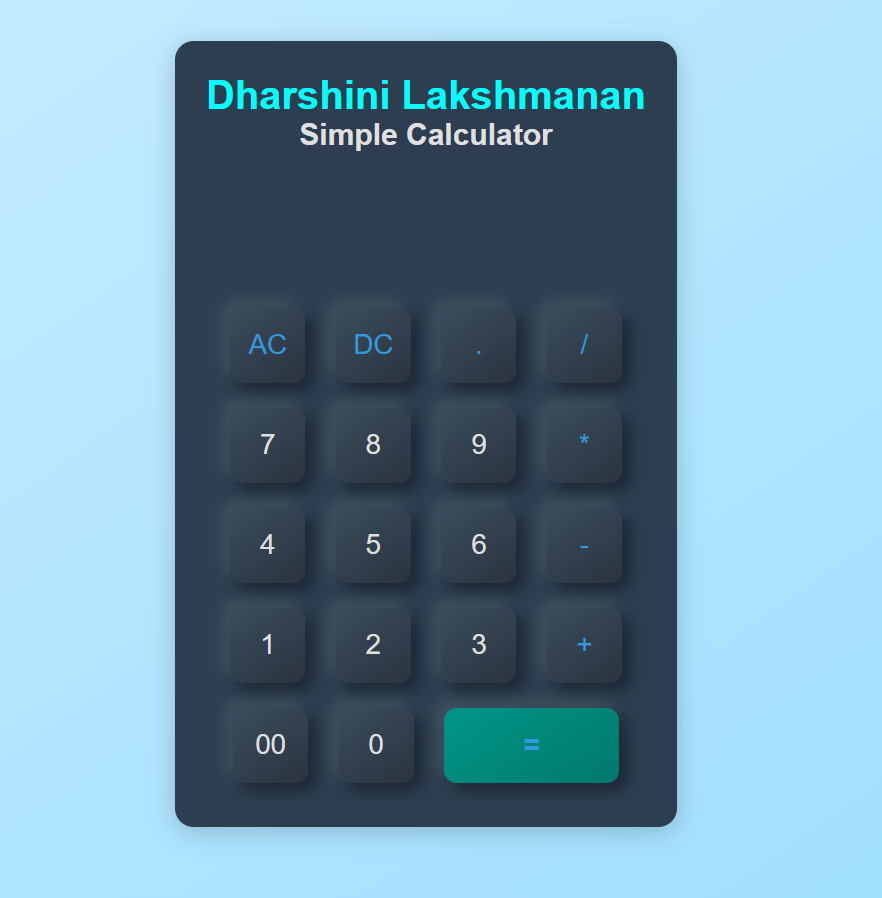

## 🔢 Simple Calculator

A modern, responsive web-based calculator with a neumorphic UI built using HTML, CSS, and JavaScript.

---

### 🖼️ Preview

---

### 💡 Features
- Performs all basic arithmetic operations
- Smart input handling (prevents invalid sequences)
- Clear (`AC`), Delete (`DC`), and double-zero (`00`) buttons
- Responsive layout and stylish design using CSS

---

### 🛠️ Tech Stack
`HTML` `CSS` `JavaScript`

---

### 🚀 How to Run
1. Clone or download this repo
2. Open `index.html` in your browser
3. Start using the calculator!

---

### 📚 What I Learned
- DOM manipulation in JS
- Building responsive layouts
- Neumorphic design using CSS shadows
